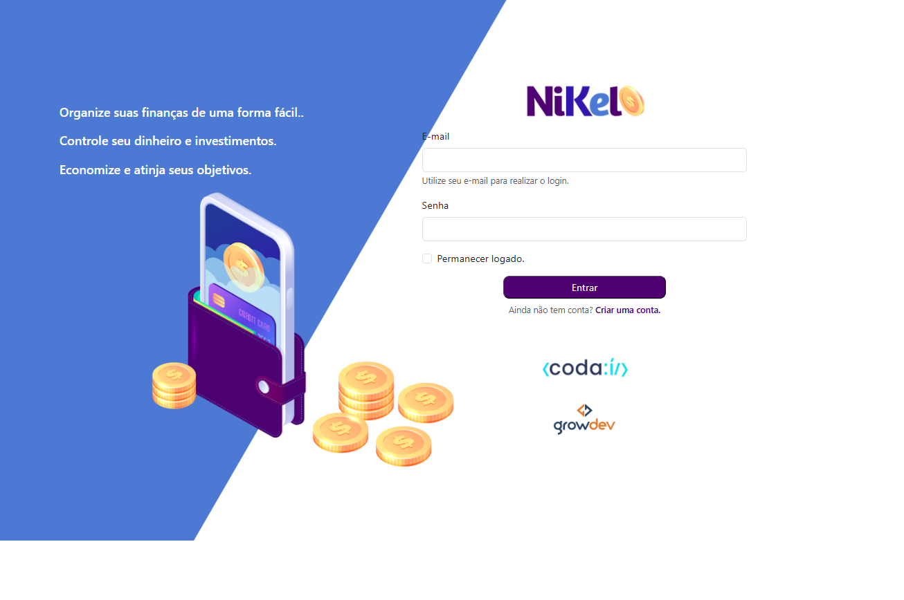
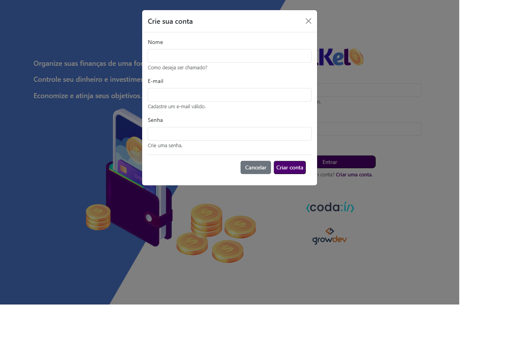
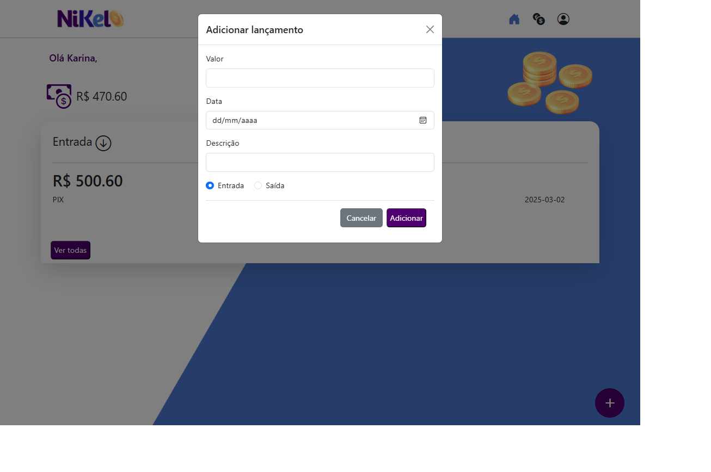
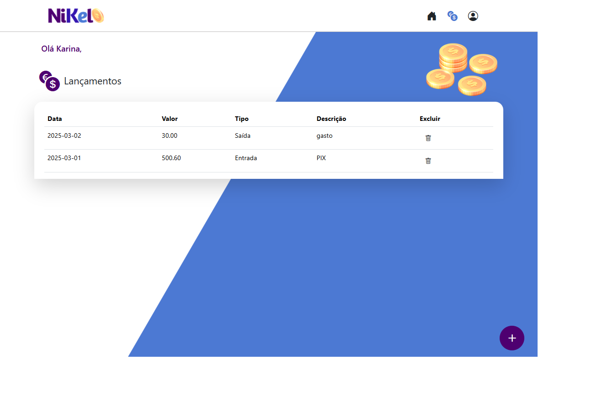

#  - Organize suas finanças de uma forma fácil.

Seja bem-vindo ao **Nikel**! Este projeto tem como objetivo ajudar na organização financeira, permitindo que o usuário cadastre suas transações de entrada e saída, calcule o saldo e gerencie suas finanças de forma prática e eficiente.

## 🎯 Objetivo

O objetivo deste projeto é criar uma aplicação simples para o controle financeiro pessoal, onde o usuário pode registrar suas transações, ver o saldo atual, excluir lançamentos e realizar login/cadastro de forma rápida e intuitiva.

## 📖 Descrição do Projeto

O **Nikel** é uma aplicação de organização financeira que permite ao usuário:

- **Cadastro de usuário** com nome, e-mail e senha.
- **Login** para acessar a plataforma.
- **Cadastro de transações**, podendo ser **entrada** ou **saída**.
- **Exclusão de transações** diretamente na lista de transações.
- **Cálculo do saldo** com base nas transações cadastradas.
- **Armazenamento local** utilizando `localStorage` para persistência dos dados.

Foi desenvolvido durante o curso **Codaí 2.0 - Primeiros passos no Front-End** da **Growdev**, e é um projeto que visa concorrer a uma bolsa de estudos.

**Acessar a Página**:
- Acesse a aplicação hospedada clicando [aqui](https://seu-link-aqui).

## 🛠️ Tecnologias Utilizadas

- **HTML5**: Para a estruturação da página e elementos.
- **JavaScript**: Para interatividade e manipulação de dados, como transações e cálculo de saldo.
- **CSS3**: Para o estilo e layout da aplicação.
- **Bootstrap**: Para a criação de componentes responsivos e otimização da interface.
- **LocalStorage**: Para armazenar os dados de transações, login e outros dados persistentes.

## ⚙️ Funcionalidades

- Cadastro de usuários com **nome**, **e-mail** e **senha**.
- **Login** para acessar a plataforma com validação de senha.
- Inclusão de transações de **entrada** e **saída**.
- **Exibição do saldo total** com base nas transações.
- **Exclusão de transações** diretamente na interface.
- Armazenamento local das transações e dados do usuário utilizando `localStorage`.
- Exibição do nome do usuário na página após login.

## 🤝 Contribuições

Contribuições são bem-vindas! Para contribuir:

- **Abra uma Issue:** Relate um bug ou sugira uma melhoria.
- **Crie um Pull Request:** Faça alterações no código e envie uma solicitação para revisão.

## 📧 Contato

Para dúvidas ou feedback, entre em contato:

- **E-mail:** [nina.kastro@icloud.com](mailto:nina.kastro@icloud.com)
- **LinkedIn:** [LinkedIn](https://www.linkedin.com/in/karinacmartins/)
- **GitHub:** [GitHub](https://github.com/karinacmartins)

## Observações

- O projeto foi desenvolvido como parte do curso Codaí 2.0 - Primeiros passos no Front-End da **Growdev** e tem como diferencial a inclusão do botão de **exclusão de transações** e o campo de **nome no cadastro**, o que torna a aplicação mais personalizada e prática.

 
 

  
Made with 💜 by <a href="https://github.com/karinacmartins">KM</a>.

